## Overview
Adding a new class requires the creation of a new Servicely table, defining the view definition and then the addition of a record in the CMDBMetadata table. To provide  a step by step guide on this, this will be done using a specific scenario. This scenario being; we wish to add a new CI class representing Apple laptops as there are special attributes that we wish to capture that do not belong on the general CMDBLaptop CI class, has enough custom fields to warrant its own table.

## Choose the parent CI class
You can view the existing physical tree by choosing the View Physical CMDB Tree menu item in the CMDB/Administration section of the left hand menu.

The obvious parent CI class is CMDBLaptop in this scenario, however in other scenarios in my not be as clear. Because CI class inheritance is an is-a relationship the question must be asked if the new CI class really is a version of the parent CI class. You might want to choose CMDBEndUserDevice as the parent CI class, but then you would not have available the attributes on CMDBLaptop and might have to duplicate  them. The general idea is to place the new CI class as low in the tree as it needs to go to make attributes available that it needs.

## Create the new CMDB Table
Choose Application/Table/Create new table from the left hand menu, which will open up Form Builder

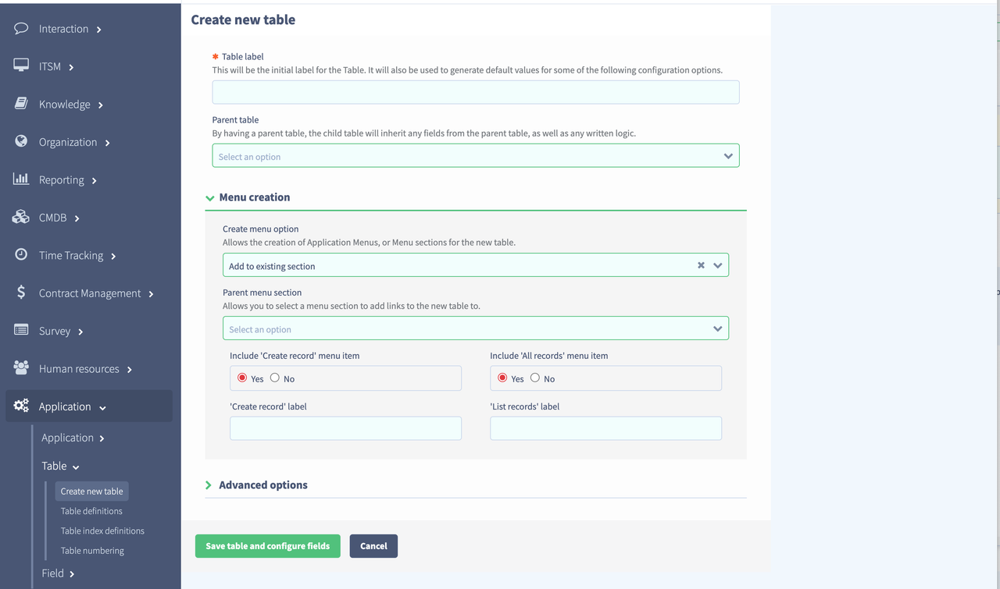

Fill in the table details. You can ignore Menu creation for now as it is sometimes unclear how the menu structure should look for CI classes, so choose None for that choice.

The convention is to give CI classes a name that starts with CMDB to distinguish them from other tables in Servicely. We’ll make the table label CMDB Apple laptop as that fits the naming convention used throughout the CMDB. This will make the table name CMDBAppleLaptop. The label is used as a more friendly version of the table name in the UI.

We search in the parent table list for CMDB laptop as that is the parent table we want.

All the settings in the Advanced options panel can be left at their defaults.

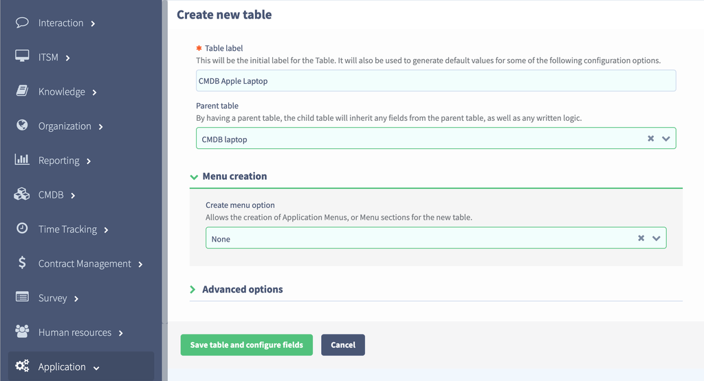
We that has been filled in you can click on the Save table and configure fields button to start adding fields. After clicking we get the add fields modal

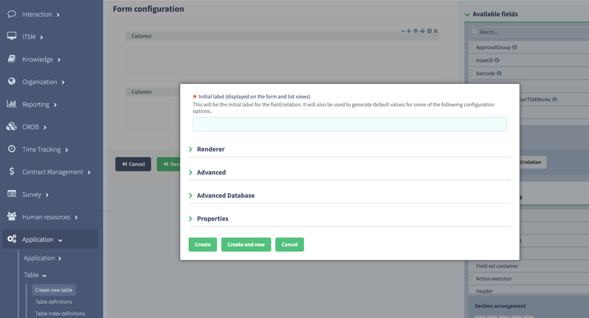
We will add one field named Chip family which will be a Choice field with two possible values: Intel or Apple Silicon. You can use the Choice editor to add the choices at this stage by typing the choice label into the Choice label box and clicking Add/Update. The Choice key and Order will be generated automatically.

All other settings on the other panels can be left at their defaults

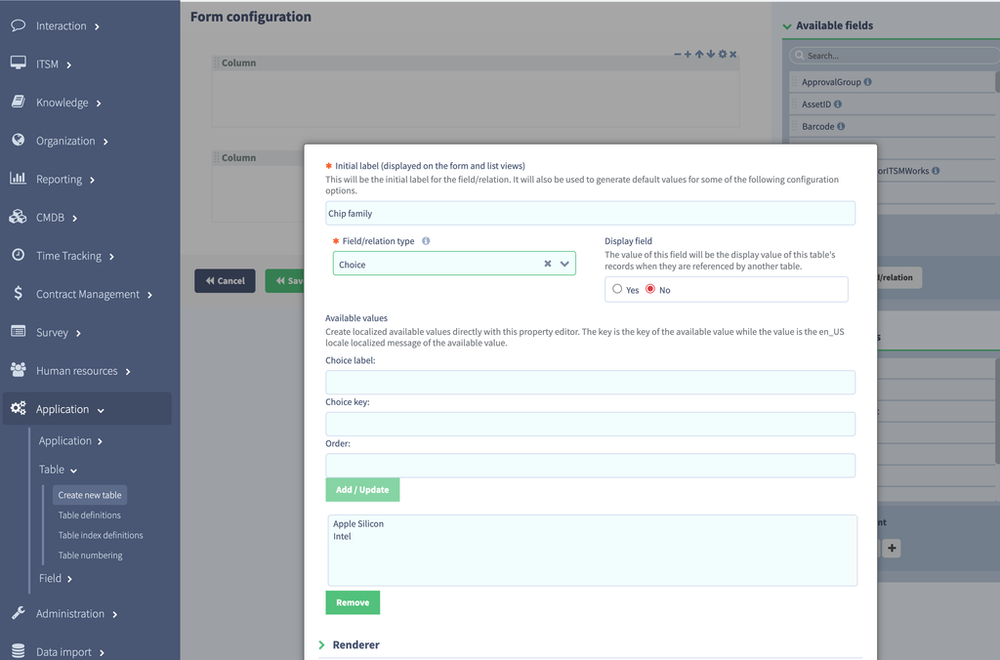
Click the Create button to add the field. Create and new is a a shortcut for adding the field and then re-presenting the add field modal again to add more, but we only have the one in this scenario.

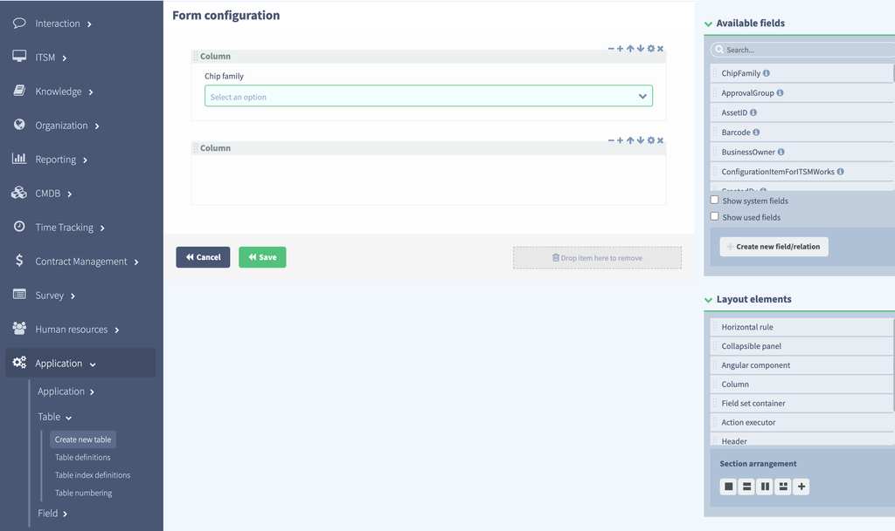
You will see that the field has been added to the form. You can modify the form as you wish at this stage but there is an important consideration to not add any other fields to the form from the Available fields list on the right. This is because we are creating a View Definition fragment in this scenario to take advantage of the rollup capability of CMDB forms. 

Click the Save button to save the newly created table to the database. A progress modal will appear.

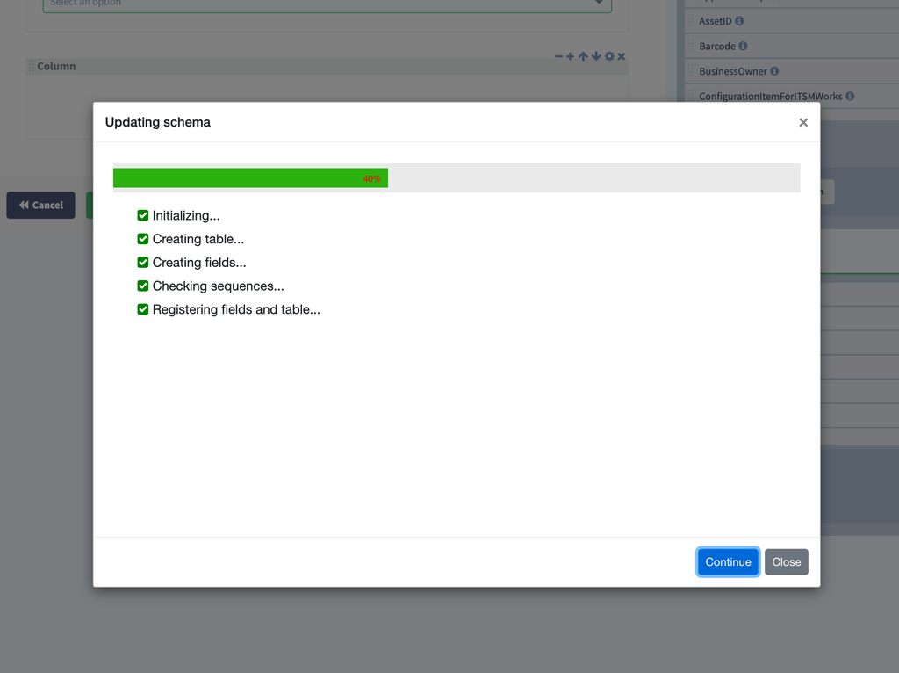

## Add CMDBMetadata record
When it has finished the form will appear. Note that this will not display the rollup capability until the metadata record has been added to the CMDBMetadata table for the newly created CI class

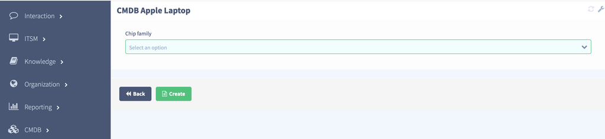
Choose the CMDB/Administration/CMDB metadata menu item and you will see the existing records

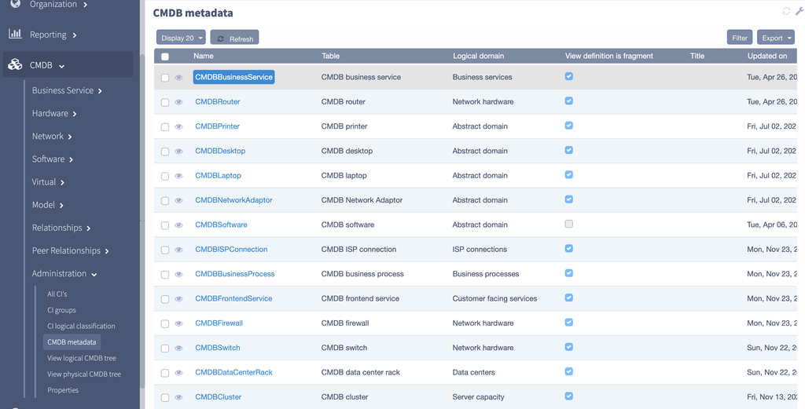
Click the New button to create a new record. The create form will open

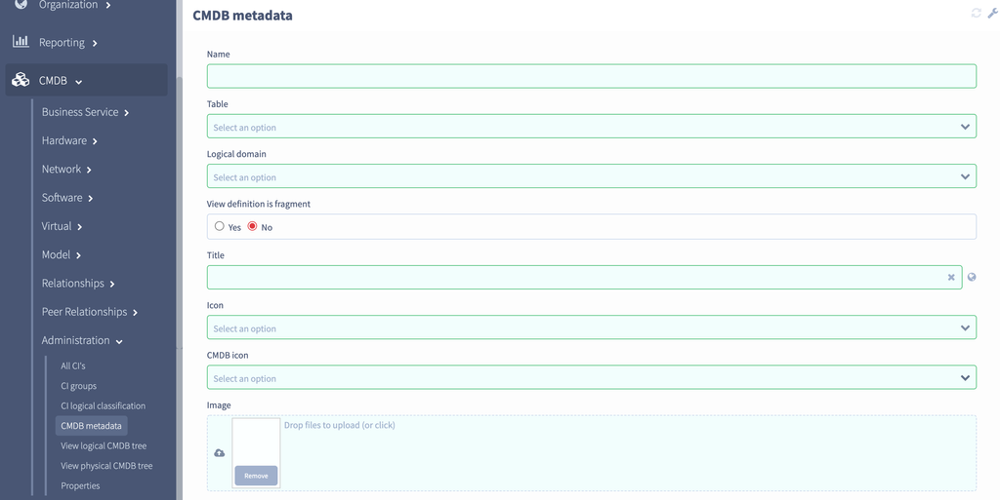
 

The Name by convention is the underlying table name so it will be CMDBAppleLaptop. The Title is by convention is the underlying table label and so it will be CMDB Apple laptop. The logical domain can be Abstract domain for now. It is important that View definition is fragment is set to true for rollup behaviour to work. Icon selection and custom infobox template can be left alone for now as the defaults are acceptable.

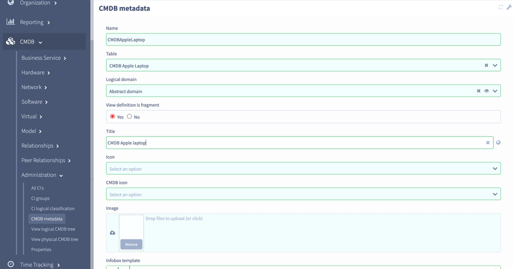
Click Create to create the record

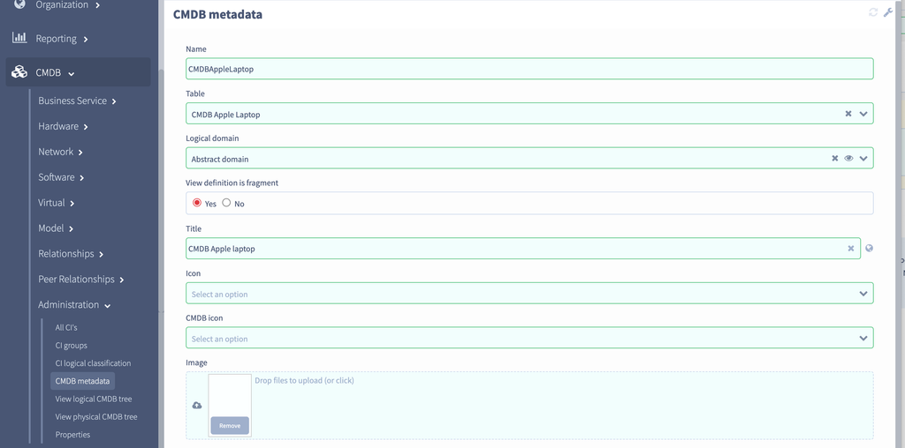
Now if you go to the  URL /#/CMDBAppleLaptop/_create you will see the rolled up view definition with all the other fields and view definition fragments made available on tabs. You will notice that there is no table for CMDB Laptop - this is because it currently has no fields. In one were added then a tab would appear automatically.

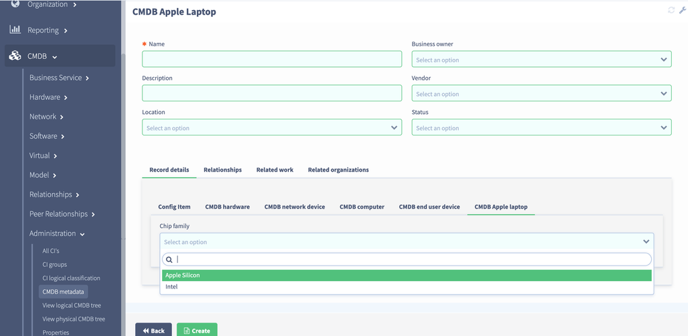

## Add a CMDB relationship
Let’s create an Apple laptop and add a relationship between it and a router. Fill in the form as follows and click Create.

Go to the URL /#/CMDBRouter/_create and fill in the form as follows and click Create

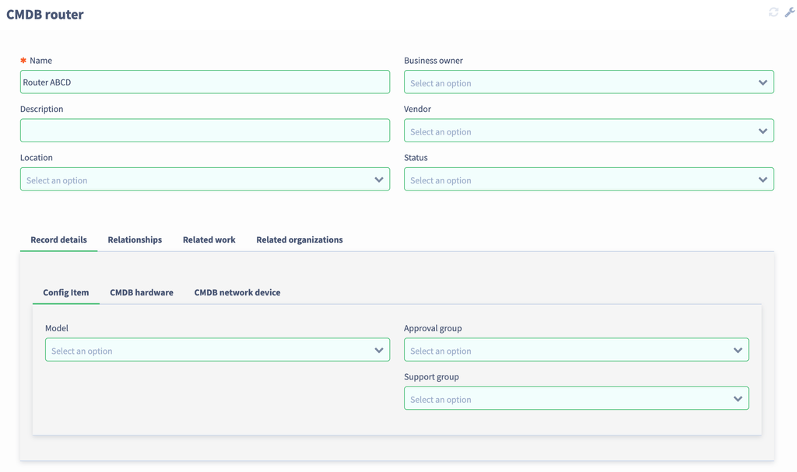
Go to the menu item CMDB/Relationships/New relationship and fill in the form as follows and click Create

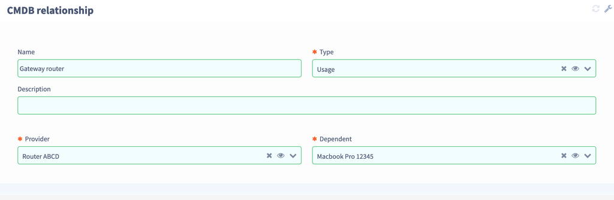
Go to the list of all CMDB Apple laptops by going to the URL /#/CMDBAppleLaptop

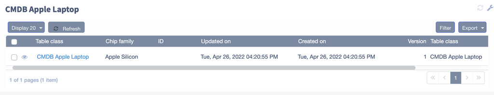
Click on the first record and you will see the record form. It now has one relationship

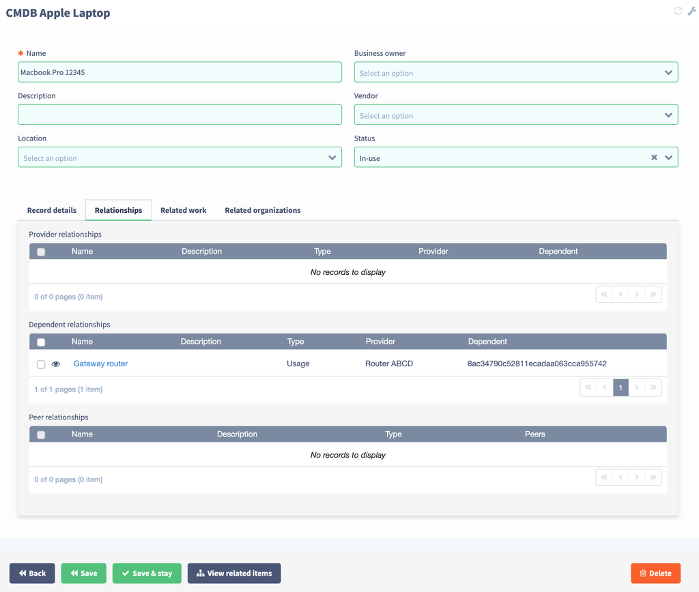
View related CIs
Click on the View related items button to see the CMDB diagram

 

